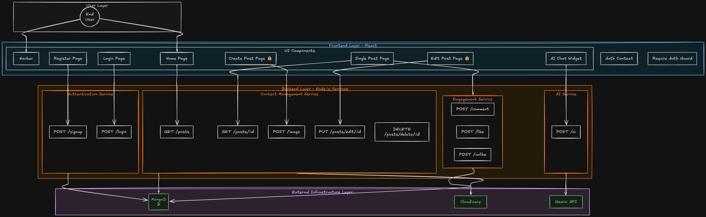

# 📝 BlogApp

**A full-stack blogging platform with image uploads, likes, comments, and a built-in AI assistant.**


BlogApp is a full-stack MERN blogging platform: a React front end talking to an Express + MongoDB API. Anyone can register, publish posts with a cover image, like and comment on posts, and chat with a Gemini-powered assistant that floats on every page. The project's roots as a small file-upload service still show through in a few places — the API prefix, a model literally called `File` — and that's called out honestly in [Known Limitations](#-known-limitations) below, along with a few other things worth knowing before you build on top of this.

## Contents

- [Live Demo](#-live-demo)
- [Features](#-features)
- [Architecture](#-architecture)
- [Tech Stack](#-tech-stack)
- [Project Structure](#-project-structure)
- [Getting Started](#-getting-started)
- [API Reference](#-api-reference)
- [Data Models](#-data-models)
- [Authentication Flow](#-authentication-flow)
- [Known Limitations](#-known-limitations)
- [Contributing](#-contributing)
- [License](#-license)
- [Author](#-author)

---

## 🌐 Live Demo


| | URL |
|---|---|
| **Frontend** | [blogapp-eight-xi.vercel.app](https://blogapp-eight-xi.vercel.app) |
| **Backend API** | [blogapp-wed6.onrender.com](https://blogapp-wed6.onrender.com) |

> This repo's various README files each mention a *different* deployment URL — a sign it's been redeployed more than once. The pair above is what's actually wired together in the current source: the backend's CORS allowlist (`backend/index.js`) trusts the frontend origin above, and the frontend's `BACKEND_URL` constant (`frontend/src/utils/config.js`) points at the backend origin above. Both run on free tiers, so the API can take up to ~50 seconds to wake up after a period of inactivity, and either URL may change on the next redeploy.

## ✨ Features

**Content**
- Create, edit, and delete posts — title, summary, full content, author, and a cover image
- Cover images upload straight to Cloudinary (jpg, jpeg, png, gif)
- Only a post's original author can edit it, enforced by comparing the post's owner ID to the logged-in user

**Engagement**
- Like / unlike posts with a live count
- Comment on posts, with the commenter's name shown alongside each comment
- A "Manage your Posts" page for editing or deleting your own posts in one place

**Accounts**
- Register and log in with bcrypt-hashed passwords and a JWT session
- Signup fires an automatic welcome email via Nodemailer
- `/create` and `/edit` are gated behind a `RequireAuth` guard that redirects signed-out visitors to `/login`

**AI Assistant**
- A floating chat widget on every page, answering free-form questions
- Backed by Google's Gemini API (`gemini-2.5-flash`), with a typewriter-style reply animation

**Interface**
- Responsive Tailwind CSS UI with gradient cards and entrance animations
- Custom 404 page for unmatched routes

## 🏗️ Architecture

<p align="center">
  
</p>

- The **React SPA** (`frontend/`) is the only thing end users touch directly. `AuthContext` tracks whether a JWT is sitting in `localStorage` and exposes `login()` / `logout()` to the rest of the app.
- **Login / Register** exchange credentials for a JWT; any request that needs to know "who's asking" sends that token as `Authorization: Bearer <token>`.
- The **Express API** (`backend/`) is organized around four jobs: authentication, post/content management, engagement (likes + comments), and the AI assistant — matching the diagram above.
- Creating a post sends `multipart/form-data` to `/api/v1/upload/image`. `express-fileupload` buffers the image to a temp file, which is then pushed to **Cloudinary**; the secure URL Cloudinary returns is what actually gets stored on the post document.
- Everything persistent — users, posts, likes, comments — lives in **MongoDB** via Mongoose models.
- The chat widget posts questions to `/api/v1/upload/ai`, which forwards them to **Gemini** and relays the answer back into the widget.

## 🧰 Tech Stack

| Layer | Technology |
|---|---|
| Frontend | React 18, React Router DOM 7, Tailwind CSS 3, Axios, `jwt-decode`, `react-icons` |
| Backend | Node.js, Express 5, Mongoose 8, `jsonwebtoken`, `bcrypt`, `express-fileupload`, `cookie-parser`, `cors`, `dotenv` |
| Data & Media | MongoDB, Cloudinary |
| AI | Google Gemini API (`gemini-2.5-flash`) via `axios` |
| Email | Nodemailer (SMTP) |
| Tooling | `nodemon` (backend dev reload), Create React App / `react-scripts` |
| Deployment | Vercel (frontend), Render (backend) |

> `react-redux` is listed in `frontend/package.json`, but there is no store or slice wired up. Auth state is managed with React Context (`src/context/AuthContext.js`).

## 📁 Project Structure

```text
BlogApp/
├── backend/
│   ├── config/
│   │   ├── cloudinary.js        # Cloudinary SDK config
│   │   └── database.js          # Mongoose connection
│   ├── controllers/
│   │   ├── login.js             # signup / login
│   │   ├── fileUpload.js        # post CRUD + Cloudinary upload
│   │   ├── likeController.js    # like / unlike toggle
│   │   ├── commentController.js
│   │   └── chatbotController.js # Gemini integration
│   ├── middlewares/
│   │   └── auth.js              # JWT verification
│   ├── models/
│   │   ├── user.js
│   │   ├── file.js               # blog post schema (see Known Limitations)
│   │   ├── likeModel.js
│   │   └── commentModel.js
│   ├── routes/
│   │   └── fileUpload.js         # all /api/v1/upload/* routes
│   └── index.js                   # app entry point
│
├── frontend/
│   ├── public/
│   ├── src/
│   │   ├── components/            # Navbar, Footer, Card, ChatBox, RequireAuth
│   │   ├── context/
│   │   │   └── AuthContext.js     # auth state (Context API)
│   │   ├── pages/                 # Home, Post, CreatePost, editPost, Login, Register, NotFound
│   │   ├── utils/config.js        # BACKEND_URL constant
│   │   ├── App.js                 # route definitions
│   │   └── index.js
│   └── tailwind.config.js
│
└── blogapp.png                     # architecture diagram used above
```

## 🚀 Getting Started

### Prerequisites

- Node.js 18+ and npm
- A MongoDB connection string (local or [Atlas](https://www.mongodb.com/atlas))
- A free [Cloudinary](https://cloudinary.com/) account (for image uploads)
- A [Gemini API key](https://ai.google.dev/) (for the chatbot)
- SMTP credentials (e.g. a Gmail app password), if you want the signup welcome email to actually send

### 1. Clone the repo

```bash
git clone https://github.com/Satendersanwal/BlogApp.git
cd BlogApp
```

### 2. Backend

```bash
cd backend
npm install
```

Create a `.env` file in `backend/` with the following:

| Variable | Description |
|---|---|
| `PORT` | Port for the Express server (defaults to `8000` if unset) |
| `DB_URL` | MongoDB connection string |
| `JWT_SECRET` | Secret used to sign and verify JWTs |
| `N` | bcrypt salt rounds, e.g. `10` |
| `CLOUDINARY_CLOUD_NAME` | Cloudinary cloud name |
| `CLOUDINARY_API_KEY` | Cloudinary API key |
| `CLOUDINARY_API_SECRET` | Cloudinary API secret |
| `GEMINI_API_KEY` | Google Gemini API key |
| `MAIL_HOST` | SMTP host used for the signup email |
| `MAIL_USER` | SMTP username |
| `MAIL_PASS` | SMTP password / app password |

Then start the server:

```bash
npm run dev      # nodemon — auto-restarts on file changes
# or
npm start        # plain node
```

The API comes up at `http://localhost:8000`. `GET /health` returns a status/uptime check you can use to confirm it's running.

### 3. Frontend

```bash
cd ../frontend
npm install
```

By default, `src/utils/config.js` points at the **deployed** backend, not a local one:

```js
export const BACKEND_URL = "https://blogapp-wed6.onrender.com";
```

To develop against your local API instead, change it to:

```js
export const BACKEND_URL = "http://localhost:8000";
```

Then run:

```bash
npm start
```

The app opens at `http://localhost:3000`.

## 📡 API Reference

All routes below are mounted under the base path `/api/v1/upload` (a naming holdover — see [Known Limitations](#-known-limitations)).

**Authentication**

| Method | Endpoint | Auth | Description |
|---|---|:---:|---|
| POST | `/signup` | – | Register a user, hash the password, email a welcome message, return a JWT |
| POST | `/login` | – | Verify credentials, return a JWT (response body + httpOnly cookie) |

**Posts**

| Method | Endpoint | Auth | Description |
|---|---|:---:|---|
| GET | `/posts` | – | List all posts, with `likes` / `comments` reduced to counts |
| GET | `/posts/:id` | – | Get one post, with `comments` populated (commenter name included) |
| POST | `/image` | ✅ | Create a post — `multipart/form-data` with `title`, `summary`, `content`, `author`, `userid`, `file` |
| PUT | `/posts/edit/:id` | ✅ owner | Update a post's title / summary / content / image |
| DELETE | `/posts/delete/:id` | – | Delete a post by ID |

**Engagement**

| Method | Endpoint | Auth | Description |
|---|---|:---:|---|
| POST | `/like` | – | Toggle a like for `{ post, user }` — likes if not already liked, unlikes if it is |
| POST | `/unlike` | – | Explicitly remove a like (not currently called by the frontend, which relies on `/like`'s toggle) |
| POST | `/comment` | – | Add `{ post, user, body }` as a comment |
| GET | `/allComments` | – | List every comment across all posts (not currently called by the frontend) |

**AI**

| Method | Endpoint | Auth | Description |
|---|---|:---:|---|
| POST | `/ai` | – | Send `{ question }`, get back a Gemini-generated `{ answer }` |

**Utility** *(mounted at the app root, not under `/api/v1/upload`)*

| Method | Endpoint | Description |
|---|---|---|
| GET | `/health` | Returns `{ status, time, uptime }` — useful for uptime monitors |
| GET | `/` | Plain confirmation that the service is running |

> ✅ = requires `Authorization: Bearer <token>` (or a `token` cookie / body field), checked by the `auth` middleware. Routes marked "–" don't currently enforce this — see [Known Limitations](#-known-limitations).

### Examples

Register a user:
```json
POST /api/v1/upload/signup
{
  "name": "Ada Lovelace",
  "email": "ada@example.com",
  "password": "a-strong-password"
}
```

Ask the chatbot:
```json
POST /api/v1/upload/ai
{ "question": "Give me three blog post ideas about React" }

→ { "success": true, "answer": "1. ... 2. ... 3. ..." }
```

Toggle a like:
```json
POST /api/v1/upload/like
{ "post": "<postId>", "user": "<userId>" }

→ { "post": { "...": "updated post, likes populated" }, "liked": true }
```

## 🗄️ Data Models

**User** — `models/user.js`
```js
{
  name: String,      // required
  email: String,     // required
  password: String,  // required, bcrypt-hashed
  time: Date          // defaults to Date.now
}
```
A post-save hook emails the new user a signup confirmation via Nodemailer.

**Post** — `models/file.js`, registered as `File`
```js
{
  userid: ObjectId,     // ref → user, required
  title: String,        // required
  imageUrl: String,     // required, Cloudinary secure_url
  author: String,       // required
  content: String,      // required
  summary: String,      // required
  time: Date,            // defaults to Date.now
  likes: [ObjectId],     // ref → Like
  comments: [ObjectId]   // ref → Comment
}
```

**Like** — `models/likeModel.js`
```js
{
  post: ObjectId,  // ref → file, required
  user: ObjectId,  // ref → user, required
}
```

**Comment** — `models/commentModel.js`
```js
{
  post: ObjectId,  // ref → file, required
  user: ObjectId,  // ref → user, required
  body: String,    // required
}
```

## 🔐 Authentication Flow

1. A user registers (`/signup`) or logs in (`/login`) with an email and password.
2. The server hashes (signup) or verifies (login) the password with bcrypt, then signs a JWT — `{ id, email, role }` — with a 24-hour expiry.
3. The token comes back two ways: in the JSON response body, and as an httpOnly cookie (3-day expiry).
4. The frontend stores the token in `localStorage` (`AuthContext.js`) and attaches it as `Authorization: Bearer <token>` on requests that need it.
5. The `auth` middleware accepts the token from the request body, a cookie, or the header, verifies it against `JWT_SECRET`, and attaches the decoded payload to `req.user`.
6. `RequireAuth` wraps the `/create` and `/edit` routes on the frontend, redirecting to `/login` if no token is found in `localStorage`.

## 🧠 Known Limitations

A few things worth knowing if you're extending this project:

- **The "already liked" heart doesn't always reflect true state on page load.** `GET /posts` returns `likes` as a plain count (not an array), and `GET /posts/:id` returns `likes` unpopulated (raw IDs), while the frontend's initial like-check expects a populated array with a `.user` field per entry. In-session toggling still works correctly, since the `/like` response *is* populated and returns an explicit `liked` boolean.
- **A few engagement routes skip the `auth` middleware**: `/like`, `/unlike`, `/comment`, and `/posts/delete/:id` trust whatever `user` / `post` IDs are sent in the request body, rather than verifying them against the caller's JWT.
- **`/image` (create post) reads `userid` from the form body**, even though the `auth` middleware in front of it already decodes a verified user ID onto `req.user` — that verified value isn't the one actually used.
- **The JWT payload includes a `role` claim** (`login.js`) that isn't part of the `User` schema, so it's always `undefined` today.
- **No `.env.example` is checked in** — the table in [Getting Started](#-getting-started) is currently the fastest way to know what your `.env` needs.
- **Blog posts live in a model called `File`** (`models/file.js`), and every route sits under `/api/v1/upload` — both are holdovers from the project's start as a generic file-upload service (see `backend/package.json`'s `"name": "file-upload"`).

None of these block local development or the features described above — they're the kind of thing worth a look before shipping this to production.

## 🤝 Contributing

1. Fork the repo and create a branch: `git checkout -b feature/your-idea`
2. Make your changes (and update this README if behavior changes)
3. Commit: `git commit -m "Add your-idea"`
4. Push and open a pull request

## 📄 License

Licensing isn't fully consistent in this repo yet: `backend/package.json` declares `ISC`, `backend/readme.md` states `MIT`, and there's no `LICENSE` file at the root. Pick one — MIT is the conventional choice for a project like this — and add a `LICENSE` file to make it official.

## 👤 Project Owner

**Satender Sanwal**
[GitHub @Satendersanwal](https://github.com/Satendersanwal) · [LinkedIn](https://www.linkedin.com/in/satender-sanwal-27b698343/)
Email: satendersanwal15@gmail.com
Mobile: +91-9728358784
